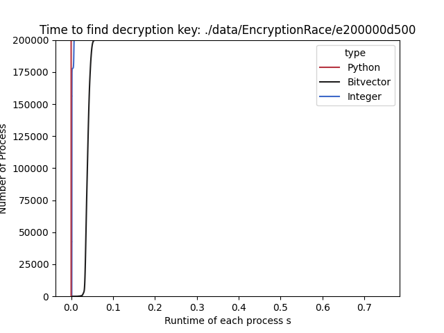
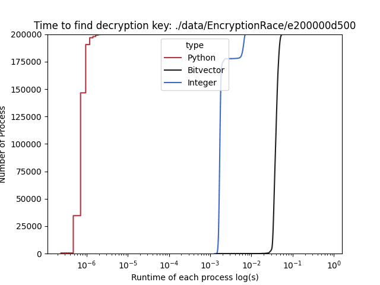
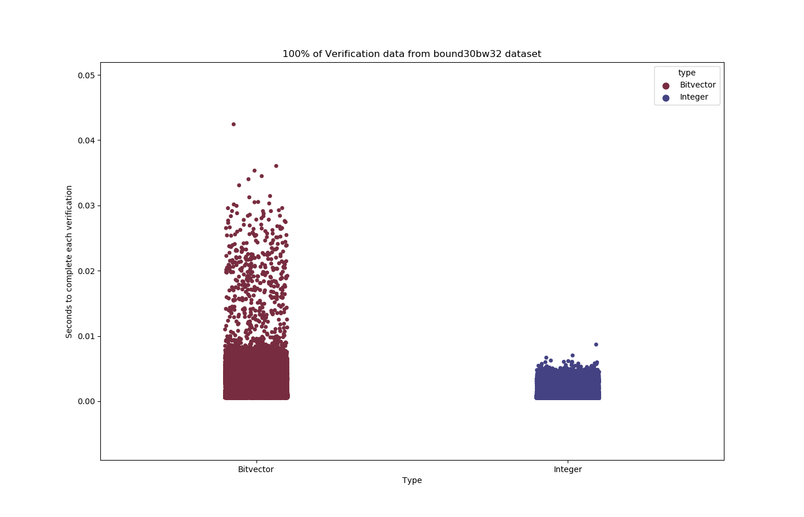
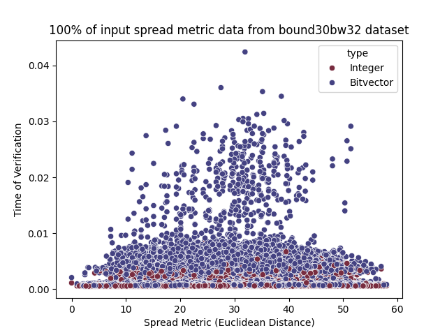
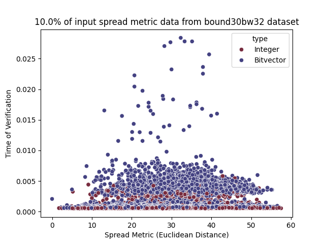
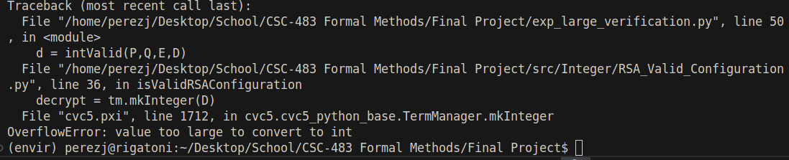

# RSA Modeling in SMT

This project investigates the limitations and performance aspects of using integer and bitvector theories in SMT (Satisfiability Modulo Theories) solvers to model RSA. 

###  Getting Started

    pip install -r requirements.txt 

## Mathematical Constraints of RSA

For given integer values P, Q, E, D. A valid RSA configuration satisfies

- P, Q must be prime
- P,Q,E,D must be greater than 1
- P is not Q
- The greatest common divisor of E and P-1*Q-1 is 1
- ed is congruent to 1 modulo p-1*q-1

## Experiments + Results

### Finding Decryption Exponent Experiment

In this experiment, for each integer and bitvector implementations of **findDecryptionExponent**, I was interested in seeing how fast these implementations were with respect to each other. I needed to come up with a way to get valid two valid primes, and a third that was relatively prime to their quotient product and have this be scalable.

#### Prime List and Windows

Since a prime is relatively prime to all numbers except any numbers that are multiples of it, in theory it would fine to also assume we can pick the exponent to a prime although this is not a requirement.

For this experiment, I utilize Sympy's *i*th prime function to generate *n* primes, and I stored them in a list. Here, I have a notion of a *window*. This is essentially how I pick the prime and exponent from the list of primes.

Since E has to be relatively prime to p-1 and q-1, this was a bit tricky to get around. My main solution was the *CONSECUTIVE WINDOW* which just takes p,q,e to be consecutive primes. This idea came from the way Euclid's Theorem is proved.

Since RSA works better when primes p,q are farther apart, I initially tried to incorporated, what I called the *FORWARD SPLIT WINDOW* which just takes the ith prime and chooses the second prime to be the "farthest" distance in the list and locks the encryption exponent to be 65537. It turns out this doesn't work for the 45092th prime :expressionless:.

> This encryption exponent is an RSA standard because of it having a lot of special number-theoretical properties.

#### Results

After running an experiment checking 200,000 cases, on the first 200,003 primes using the Consecutive Prime window, I got the following

Normal Time            |  Logarithmic Time (for better resolution)
:-------------------------:|:-------------------------:
  |  
> In this run, I required the decryption exponent to be greater than 500 and the bitwidth to be 24 which would suffice to represent each prime up to the 200,000th prime.  

In these graphs, all findDecryption function calls were timed, and they are plotted essentially in order from slowest to fastest where the 1st process was the fastest run and the 200000th process was the slowest. Here we can observe a few interesting things. 

Although bitvectors was the slowest, it has a relatively "consistent/straight" line, implying that for any given input for a given bitwidth, CVC5's bitvector theory will perform more or less the same.  This is clearly not true for integers.

I was interested in seeing how the bitvector and integer theories held up against plain python. Since we are using a CVC5 API for the integer and bitvector runs, the startup time is included within their runtimes.

### Verification Experiment
In this experiment, for each integer and bitvector implementations of **isValidRSAConfiguration**, I was interest in seeing how fast these implementation can just check if the properties were satisfied. What I came up with is quite barbaric solution literally checking all possible combinations of inputs up to a point. More specifically, I timed every isValidRSAConfiguration(a,b,c,d) where a,b,c,d in the interval 0 to a chosen number.

Some fundamental ideas behind my choice in focusing on inputs in the interval from 0 to a specified number are the following.

Notice that, if P,Q are negative then the RSA configuration is trivially invalid, since negative numbers are not prime. More over, if E,D are negative then their corresponds a positive exponent under the same modulus that it is congruent to. With these two idea, we only really need to consider positive values to get the whole picture of how these implementations will perform.

#### Spread Metric

Since the verification experiment exhaustively checks all positive inputs up to a number, I tried to come up with a way that'll expose more information about the performances with respect to the "variation" between primes and its encryption exponent. What I used was the three dimensional *[Euclidean Distance]{https://en.wikipedia.org/wiki/Euclidean_distance}*. 

#### Result

After calling the isValidRSAConfiguration on all values in the range 0 to 30, with a bitwidth of 32, this turned out to be an outstanding 810,000 calls each. Since running this experiment up to a value n collects n^4 values per theory, I implemented a sampling concept, where you can only display a percentage of the data collected.

In this graph, all isValidRSAConfiguration function calls were timed, and they are just plotted out under their category, whether they were a bitvector run or an integer run. Here we can observe a few interesting things. 

Despite running on the same inputs, again bitvectors were on average much slower and at times performed 4 times as worst in the most extreme case. 

On a different note, consider the spread metrics for this experiment.

All data           |  10% of data (for better resolution)
:-------------------------:|:-------------------------:
  |  

Notice on average, there exists less inputs where the distance is 0 and less inputs where the distance is at its max which is 60 in this run.

Since their exist more combinations of input with a euclidean distance near the middle of our range then near the extremes, we naturally get a skewed range of values more based around the center. However, coincidentally this seems to show that CVC5 seems to perform worse or works harder for both types of theories when the input is near the middle, implying when inputs the most spread out these tend to be the harder values to verify. We can quickly  rule out the possibility of the slowest processes corresponding to the function calls where the input values are near the same value since the density of points near the extremes have a consistent line going from one extreme to the other. 

##  Thoughts / Challenges / Conclusion

In these experiments I would of liked to conduct them on a much larger scales and less trivial problems, however the problem space explodes with larger numbers and CVC5 just can't work with numbers that are large.

 

With this, I can say that this was probably not the best topic to choose for the given logics we learned but nonetheless it was very informative at seeing the limitations of utilizing SMT. Additionally, a lot of the "properties" RSA relies on are just probabilistic which doesn't really pair with these discrete systems.

When it came to developing the Bitvector specification, I didn't take into account how bitvector multiplication would happen for numbers with respect to the bit width. So right now, the way I have it implemented, is that it assumes that the given BITWIDTH will be contained/padded enough to cover the multiplication. If it is not, when verifying RSA, you either get that all true answers become false or you get a bit overflow problem. Moreover, there was not any good ways to do bitvector exponentiation, so I couldn't verify all messages like the way I did for integers.  

When it comes to the experiments, I refrained from using completely randomized approaches since they typically don't accurately showcase how performance is dispersed. So I didn't really want to utilize a RSA library in python that is actively maximizing randomness however I did implement one that generates a public and private key pair and tries to use CVC5 to check if it is a proper RSA configuration but it cannot handle anything over 32 Bits.
